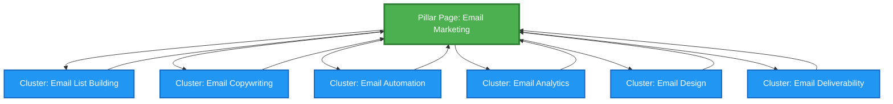

# Content Strategy & Quality Guide for SEO

## Overview

Content strategy and quality are fundamental pillars of modern SEO success. This guide focuses on creating valuable, relevant, and engaging content that satisfies user intent, establishes topical authority, and drives organic search performance.

---

## Table of Contents

1. [Understanding User Intent](#understanding-user-intent)
2. [Pillar Content Strategy](#pillar-content-strategy)
3. [Topic Clusters Architecture](#topic-clusters-architecture)
4. [Content Quality Framework](#content-quality-framework)
5. [Search Query Satisfaction](#search-query-satisfaction)
6. [Implementation Checklist](#implementation-checklist)

---

## Understanding User Intent

### What is User Intent?

User intent (or search intent) is the primary goal a user has when typing a query into a search engine. Understanding and matching user intent is critical for content success.

### The Four Types of Search Intent

#### 1. **Informational Intent**
- **Goal**: User wants to learn or find information
- **Query Examples**: 
  - "what is content marketing"
  - "how to optimize images for SEO"
  - "benefits of organic search"
- **Content Type**: Blog posts, guides, tutorials, how-to articles, educational videos
- **Optimization Strategy**: 
  - Provide comprehensive, well-structured information
  - Use clear headings and subheadings
  - Include examples and visuals
  - Answer related questions (People Also Ask)

#### 2. **Navigational Intent**
- **Goal**: User wants to find a specific website or page
- **Query Examples**:
  - "facebook login"
  - "amazon customer service"
  - "nike official site"
- **Content Type**: Homepage, brand pages, login pages
- **Optimization Strategy**:
  - Ensure brand name is prominent
  - Optimize for branded keywords
  - Clear site structure and navigation
  - Schema markup for organization

#### 3. **Commercial Investigation Intent**
- **Goal**: User is researching before making a purchase decision
- **Query Examples**:
  - "best CRM software 2024"
  - "iPhone vs Samsung comparison"
  - "top running shoes reviews"
- **Content Type**: Comparison articles, reviews, buyer's guides, "best of" lists
- **Optimization Strategy**:
  - Provide detailed comparisons
  - Include pros and cons
  - Add product specifications
  - Use comparison tables
  - Include expert opinions and user reviews

#### 4. **Transactional Intent**
- **Goal**: User is ready to make a purchase or complete an action
- **Query Examples**:
  - "buy iPhone 15 pro"
  - "subscribe to Netflix"
  - "book flight to Paris"
- **Content Type**: Product pages, service pages, checkout pages, pricing pages
- **Optimization Strategy**:
  - Clear call-to-action (CTA)
  - Product details and specifications
  - Pricing information
  - Trust signals (reviews, guarantees)
  - Easy conversion path

### How to Identify User Intent

1. **Analyze SERP Features**: Look at what Google shows for your target keyword
   - Featured snippets = Informational
   - Shopping results = Transactional
   - Knowledge panels = Informational/Navigational
   - Local pack = Local transactional

2. **Examine Top-Ranking Content**: Study the top 10 results
   - What format are they using? (blog post, product page, video)
   - What questions are they answering?
   - What depth of information do they provide?

3. **Use Keyword Modifiers**:
   - **Informational**: how, what, why, guide, tutorial, tips
   - **Commercial**: best, top, review, comparison, vs
   - **Transactional**: buy, purchase, order, subscribe, download, coupon

4. **Leverage Analytics Data**:
   - Review on-site search queries
   - Analyze bounce rates and time on page
   - Study conversion paths

---

## Pillar Content Strategy

### What is Pillar Content?

Pillar content (also called cornerstone content) is a comprehensive, authoritative piece of content that covers a broad topic in depth. It serves as the foundation of your content strategy and links to more detailed cluster content.

### Characteristics of Effective Pillar Content

✅ **Comprehensive**: Covers the topic thoroughly (typically 2,000-5,000+ words)  
✅ **Evergreen**: Remains relevant over time with minimal updates  
✅ **Authoritative**: Demonstrates expertise and builds trust  
✅ **Well-Structured**: Uses clear hierarchy with H2, H3, H4 headings  
✅ **Linkable**: Serves as a hub linking to related cluster content  
✅ **Optimized**: Targets high-volume, competitive keywords  

### Creating Pillar Content: Step-by-Step

#### Step 1: Choose Your Pillar Topic
- Select a broad topic central to your business
- Ensure sufficient search volume and business relevance
- Verify you can create 10-20+ related cluster topics

**Example Pillar Topics**:
- "Complete Guide to Email Marketing"
- "Content Marketing Strategy"
- "SEO Best Practices"
- "Social Media Marketing"

#### Step 2: Research and Outline
```markdown
## Pillar Content Outline Template

### Introduction
- What is [Topic]?
- Why is it important?
- What will this guide cover?

### Section 1: Fundamentals
- Basic concepts
- Key terminology
- Core principles

### Section 2: Strategy & Planning
- How to develop a strategy
- Setting goals
- Planning framework

### Section 3: Implementation
- Step-by-step process
- Tools and resources
- Best practices

### Section 4: Advanced Techniques
- Expert strategies
- Optimization tips
- Common pitfalls to avoid

### Section 5: Measurement & Analysis
- Key metrics
- Analytics and tracking
- Continuous improvement

### Conclusion
- Summary of key points
- Next steps
- Related resources (cluster content links)
```

#### Step 3: Create Comprehensive Content
- **Depth over breadth**: Cover each subtopic thoroughly
- **Use multiple formats**: Text, images, videos, infographics, tables
- **Include examples**: Real-world case studies and scenarios
- **Add data**: Statistics, research findings, expert quotes
- **Make it scannable**: Use bullet points, numbered lists, visual breaks

#### Step 4: Optimize for SEO
- **Target keyword**: Include in title, H1, first paragraph, URL
- **Semantic keywords**: Use related terms and synonyms naturally
- **Internal linking**: Link to relevant cluster content (10-20+ links)
- **External linking**: Reference authoritative sources
- **Meta optimization**: Compelling title tag and meta description
- **Schema markup**: Article schema, FAQ schema, How-to schema

#### Step 5: Promote and Update
- Share across social channels
- Email to subscribers
- Build backlinks through outreach
- Update quarterly or bi-annually
- Monitor performance and refine

---

## Topic Clusters Architecture

### What are Topic Clusters?

Topic clusters are a content organization model where a pillar page covers a broad topic, and cluster content pages dive deep into specific subtopics, all interlinked to create a semantic relationship.

### The Hub-and-Spoke Model



### Benefits of Topic Clusters

1. **Improved SEO Performance**
   - Establishes topical authority
   - Better internal linking structure
   - Helps search engines understand content relationships
   - Increases crawl efficiency

2. **Enhanced User Experience**
   - Easier content discovery
   - Logical information architecture
   - Comprehensive topic coverage
   - Reduced bounce rates

3. **Content Organization**
   - Clear content strategy
   - Identifies content gaps
   - Streamlines content creation
   - Facilitates content audits

### Building a Topic Cluster: Step-by-Step

#### Step 1: Identify Core Topics
- Brainstorm 3-5 core topics relevant to your business
- Ensure each topic has sufficient breadth and depth
- Align with business goals and audience needs

#### Step 2: Keyword Research for Clusters
Use tools like:
- Google Keyword Planner
- Ahrefs
- SEMrush
- AnswerThePublic
- Google Search Console

**Research Process**:
1. Start with your pillar keyword
2. Find related long-tail keywords
3. Group keywords by subtopic
4. Identify search volume and difficulty
5. Map keywords to content pieces

#### Step 3: Create Your Cluster Map

**Example: Email Marketing Topic Cluster**

| Pillar Page | Cluster Content | Target Keyword | Search Volume | Difficulty |
|-------------|-----------------|----------------|---------------|------------|
| Email Marketing Guide | How to Build an Email List | email list building | 2,400 | Medium |
| Email Marketing Guide | Email Copywriting Tips | email copywriting | 1,900 | Medium |
| Email Marketing Guide | Email Automation Tools | email automation | 3,600 | High |
| Email Marketing Guide | Email Marketing Metrics | email analytics | 1,200 | Low |
| Email Marketing Guide | Email Design Best Practices | email design | 2,100 | Medium |
| Email Marketing Guide | Improve Email Deliverability | email deliverability | 880 | Low |

#### Step 4: Create Cluster Content
- **Focus**: Each cluster page targets a specific long-tail keyword
- **Length**: Typically 1,000-2,500 words (shorter than pillar)
- **Depth**: Go deep on the specific subtopic
- **Linking**: Always link back to the pillar page
- **Cross-linking**: Link to related cluster pages when relevant

#### Step 5: Implement Internal Linking Strategy

**Linking Rules**:
1. **Pillar → Clusters**: Link from pillar to all cluster pages (10-20+ links)
2. **Clusters → Pillar**: Every cluster links back to pillar (1-2 links)
3. **Clusters → Clusters**: Link between related clusters (2-5 links)
4. **Use descriptive anchor text**: Include target keywords naturally

**Example Internal Link Structure**:
```html
<!-- On Pillar Page -->
<p>To learn more about building your subscriber base, check out our guide on 
<a href="/email-list-building">how to build an email list</a>.</p>

<!-- On Cluster Page -->
<p>For a comprehensive overview of email marketing, see our 
<a href="/email-marketing-guide">complete email marketing guide</a>.</p>

<!-- Between Cluster Pages -->
<p>Once you've built your list, focus on 
<a href="/email-copywriting">writing compelling email copy</a> to engage subscribers.</p>
```

---

## Content Quality Framework

### Google's E-E-A-T Principles

Google evaluates content quality using **E-E-A-T**:

#### 1. **Experience**
- First-hand or life experience with the topic
- Personal insights and real-world examples
- Original research or case studies
- Authentic user-generated content

**How to Demonstrate Experience**:
- Share personal stories and anecdotes
- Include original photos, videos, or data
- Showcase before/after results
- Feature customer testimonials and case studies

#### 2. **Expertise**
- Formal qualifications or credentials
- Professional experience in the field
- Recognition by peers or industry
- Depth of knowledge demonstrated

**How to Demonstrate Expertise**:
- Author bios with credentials
- Cite professional experience
- Reference certifications or awards
- Link to published work or speaking engagements

#### 3. **Authoritativeness**
- Recognition as a go-to source
- Citations and mentions by other experts
- Quality and quantity of backlinks
- Brand reputation

**How to Build Authoritativeness**:
- Earn high-quality backlinks
- Get featured in industry publications
- Participate in expert roundups
- Build a strong social media presence
- Encourage brand mentions

#### 4. **Trustworthiness**
- Accuracy of information
- Transparency and honesty
- Security (HTTPS, privacy policy)
- Clear contact information

**How to Build Trust**:
- Fact-check all claims
- Cite reputable sources
- Display security badges
- Include clear privacy policy and terms
- Show contact information prominently
- Respond to comments and feedback

### Content Quality Checklist

#### Before Publishing, Ensure:

**✅ Accuracy & Credibility**
- [ ] All facts verified with credible sources
- [ ] Statistics are current and properly cited
- [ ] Claims are supported with evidence
- [ ] No misleading or exaggerated statements

**✅ Comprehensiveness**
- [ ] Topic covered thoroughly
- [ ] Common questions answered
- [ ] Related subtopics addressed
- [ ] Sufficient depth for target audience

**✅ Originality**
- [ ] Unique perspective or insights
- [ ] Original research or data
- [ ] Not duplicated from other sources
- [ ] Adds value beyond existing content

**✅ Readability**
- [ ] Clear, concise writing
- [ ] Appropriate reading level for audience
- [ ] Short paragraphs (2-4 sentences)
- [ ] Active voice predominates
- [ ] Free of jargon (or jargon explained)

**✅ Structure & Formatting**
- [ ] Logical flow and organization
- [ ] Descriptive headings (H2, H3, H4)
- [ ] Bullet points and numbered lists
- [ ] Visual breaks (images, videos, tables)
- [ ] Table of contents for long content

**✅ Visual Elements**
- [ ] Relevant, high-quality images
- [ ] Alt text for all images
- [ ] Charts or graphs for data
- [ ] Videos or infographics where appropriate
- [ ] Proper image compression

**✅ SEO Optimization**
- [ ] Target keyword in title, H1, first paragraph
- [ ] Semantic keywords used naturally
- [ ] Meta title (50-60 characters)
- [ ] Meta description (150-160 characters)
- [ ] URL is short and descriptive
- [ ] Internal links to related content (5-10+)
- [ ] External links to authoritative sources (2-5)
- [ ] Schema markup implemented

**✅ User Experience**
- [ ] Mobile-friendly design
- [ ] Fast page load speed (<3 seconds)
- [ ] Clear call-to-action
- [ ] Easy navigation
- [ ] No intrusive popups or ads

---

## Search Query Satisfaction

### What is Search Query Satisfaction?

Search query satisfaction measures how well your content meets the user's needs when they click through from search results. High satisfaction leads to better rankings, lower bounce rates, and increased conversions.

### Key Metrics for Query Satisfaction

1. **Dwell Time**: How long users stay on your page
2. **Bounce Rate**: Percentage of users who leave immediately
3. **Click-Through Rate (CTR)**: Percentage who click your result in SERPs
4. **Pogo-Sticking**: Users returning to search results quickly
5. **Conversion Rate**: Users completing desired actions

### Strategies to Satisfy Search Queries

#### 1. Match Content to Intent
```markdown
Query: "how to make coffee"
❌ Bad: Product page selling coffee makers
✅ Good: Step-by-step tutorial on brewing coffee

Query: "best coffee maker 2024"
❌ Bad: General article about coffee history
✅ Good: Comparison review of top coffee makers

Query: "buy espresso machine"
❌ Bad: Blog post about espresso
✅ Good: Product category page with purchase options
```

#### 2. Answer the Query Immediately
- **Hook**: Answer the main question in the first 100-150 words
- **Expand**: Provide additional context and details below
- **Support**: Use examples, data, and visuals

**Example Structure**:
```markdown
# How to Make Cold Brew Coffee at Home

Cold brew coffee is made by steeping coarse coffee grounds in cold water 
for 12-24 hours, then straining. The result is a smooth, less acidic coffee 
concentrate that can be diluted with water or milk.

## What You'll Need
[List of ingredients and equipment]

## Step-by-Step Instructions
[Detailed process]

## Tips for the Best Cold Brew
[Expert advice]
```

#### 3. Optimize for Featured Snippets

**Types of Featured Snippets**:

**Paragraph Snippet**:
```markdown
## What is SEO?

SEO (Search Engine Optimization) is the practice of optimizing websites 
to rank higher in search engine results pages. It involves improving 
technical aspects, creating quality content, and building authoritative 
backlinks to increase organic visibility and traffic.
```

**List Snippet**:
```markdown
## How to Optimize Images for SEO

1. Choose the right file format (JPEG for photos, PNG for graphics)
2. Compress images to reduce file size
3. Use descriptive file names with keywords
4. Add alt text describing the image
5. Implement lazy loading for faster page speed
6. Use responsive images for mobile devices
```

**Table Snippet**:
| SEO Factor | Importance | Difficulty |
|------------|------------|------------|
| Content Quality | Very High | Medium |
| Backlinks | Very High | High |
| Page Speed | High | Low |
| Mobile-Friendly | High | Low |
| HTTPS | Medium | Low |

#### 4. Provide Comprehensive Coverage

**The Skyscraper Technique**:
1. Find top-ranking content for your target keyword
2. Analyze what they cover
3. Create something significantly better:
   - More comprehensive
   - More current
   - Better designed
   - More actionable
   - Better examples

#### 5. Enhance User Engagement

**Interactive Elements**:
- Calculators and tools
- Quizzes and assessments
- Interactive infographics
- Comment sections
- Social sharing buttons
- Related content recommendations

**Content Upgrades**:
- Downloadable PDFs or checklists
- Templates and worksheets
- Video tutorials
- Email courses
- Exclusive resources

#### 6. Optimize for "People Also Ask"

Research PAA questions for your target keyword and answer them in your content:

```markdown
## Frequently Asked Questions

### How long does SEO take to work?
SEO typically takes 3-6 months to show significant results, though this 
varies based on competition, domain authority, and the quality of your 
optimization efforts.

### Is SEO better than paid advertising?
SEO and paid advertising serve different purposes. SEO provides long-term, 
sustainable traffic but takes time to build. Paid ads deliver immediate 
results but require ongoing investment. Most businesses benefit from using both.

### Can I do SEO myself?
Yes, basic SEO can be done yourself with proper education and tools. However, 
competitive industries or complex technical issues may require professional help.
```

---

## Implementation Checklist

### Phase 1: Research & Planning (Week 1-2)

- [ ] Conduct audience research and create personas
- [ ] Perform comprehensive keyword research
- [ ] Analyze competitor content strategies
- [ ] Identify 3-5 core pillar topics
- [ ] Map out topic clusters for each pillar
- [ ] Create content calendar (3-6 months)

### Phase 2: Pillar Content Creation (Week 3-6)

- [ ] Outline first pillar page
- [ ] Research and gather data/sources
- [ ] Write comprehensive pillar content (2,000-5,000 words)
- [ ] Create supporting visuals (images, infographics, videos)
- [ ] Optimize for SEO (keywords, meta tags, schema)
- [ ] Internal linking structure planned
- [ ] Publish and promote pillar page

### Phase 3: Cluster Content Development (Week 7-16)

- [ ] Create 10-15 cluster content pieces per pillar
- [ ] Each cluster: 1,000-2,500 words
- [ ] Optimize each for specific long-tail keywords
- [ ] Link all clusters back to pillar
- [ ] Cross-link related clusters
- [ ] Publish on consistent schedule (2-3 per week)

### Phase 4: Optimization & Promotion (Ongoing)

- [ ] Monitor performance metrics (traffic, rankings, engagement)
- [ ] Update content quarterly
- [ ] Build backlinks through outreach
- [ ] Promote via social media and email
- [ ] Respond to comments and feedback
- [ ] Identify and fill content gaps
- [ ] Expand successful clusters

### Phase 5: Measurement & Iteration (Monthly)

- [ ] Review Google Analytics data
- [ ] Track keyword rankings
- [ ] Analyze user behavior (bounce rate, time on page)
- [ ] Measure conversions and ROI
- [ ] Identify top-performing content
- [ ] Replicate successful strategies
- [ ] Refine underperforming content

---

## Tools & Resources

### Content Research
- **Google Trends**: Identify trending topics
- **AnswerThePublic**: Discover questions people ask
- **BuzzSumo**: Find popular content and influencers
- **Reddit/Quora**: Understand audience pain points

### Keyword Research
- **Google Keyword Planner**: Free keyword data
- **Ahrefs**: Comprehensive SEO tool
- **SEMrush**: Keyword and competitor analysis
- **Moz Keyword Explorer**: Keyword difficulty and opportunity

### Content Creation
- **Grammarly**: Grammar and readability checking
- **Hemingway Editor**: Improve readability
- **Canva**: Create visual content
- **Loom**: Record video tutorials

### SEO Optimization
- **Yoast SEO**: WordPress SEO plugin
- **Screaming Frog**: Technical SEO audits
- **Google Search Console**: Monitor search performance
- **Schema.org**: Structured data markup

### Analytics
- **Google Analytics 4**: Website traffic and behavior
- **Hotjar**: Heatmaps and user recordings
- **Microsoft Clarity**: Free user behavior analytics

---

## Conclusion

Effective content strategy and quality are the foundation of sustainable SEO success. By understanding user intent, creating comprehensive pillar content, organizing information into topic clusters, and consistently delivering high-quality content that satisfies search queries, you'll establish topical authority, improve rankings, and drive meaningful organic traffic.

**Key Takeaways**:
1. Always start with user intent—create content that serves the searcher's needs
2. Build topical authority through pillar pages and cluster content
3. Focus on E-E-A-T principles to demonstrate expertise and build trust
4. Optimize for search query satisfaction, not just keywords
5. Measure, iterate, and continuously improve your content

**Next Steps**:
- Choose your first pillar topic
- Conduct keyword research for cluster content
- Create a content calendar
- Start writing your pillar page
- Build out your topic cluster systematically

Remember: Quality always trumps quantity. One exceptional pillar page with 10 well-crafted cluster articles will outperform 50 mediocre blog posts every time.
